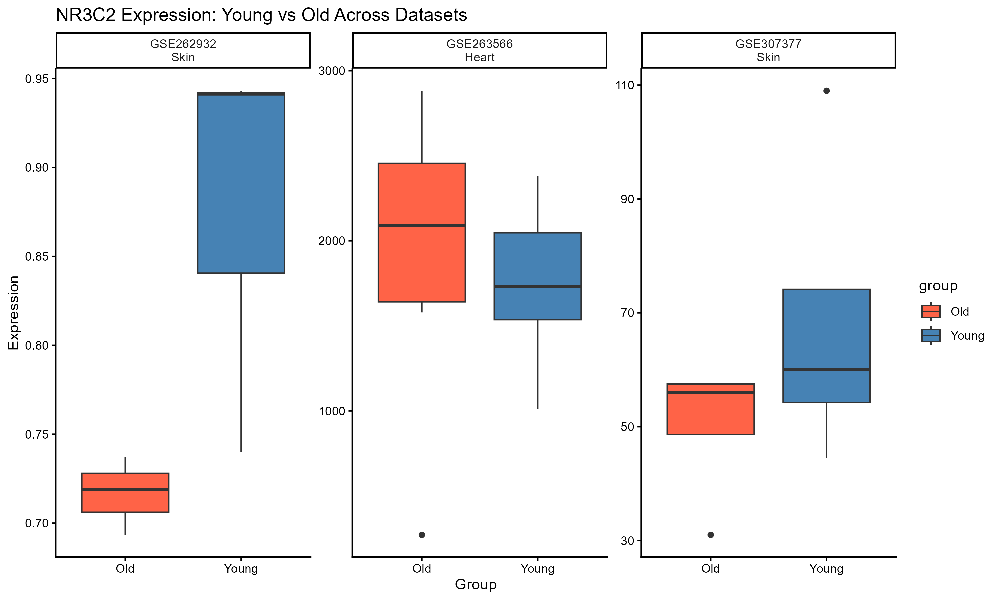

# NR3C2 Aging Expression Analysis

## Overview
Bioinformatics analysis of NR3C2 (Mineralocorticoid Receptor) gene expression 
in young vs aged samples across multiple public GEO datasets.

## Datasets Used
| Dataset | Tissue | Young Samples | Old Samples |
|---|---|---|---|
| GSE307377 | Skin Fibroblast | 4 | 5 |
| GSE191055 | Skin Fibroblast | 1 | 1 |
| GSE262932 | Skin Fibroblast | 3 | 3 |
| GSE263566 | Heart Tissue | 8 | 8 |

## Key Findings
- NR3C2 shows consistent downregulation in aged skin fibroblasts
- NR3C2 shows upregulation in aged heart tissue
- Suggests tissue-specific regulation of mineralocorticoid receptor during aging

## Tools Used
- R version 4.6.0
- GEOquery, DESeq2, ggplot2, limma
- Statistical tests: t-test, Wilcoxon test, Fisher's method

## Scripts
- 01_install_packages.R — Package installation
- 02_NR3C2_analysis.R — Main analysis
- 03_GSE262932_analysis.R — Dataset 3 analysis
- 04_GSE263566_analysis.R — Dataset 4 analysis
- 05_statistical_testing.R — Statistical tests
- 06_final_report.R — Final report generation
- 07_meta_analysis.R — Meta-analysis

## Results

## Author
**Shahrzad Zamani**
BSc Medical Genetics and Biology Student
Bioinformatics Researcher
📧 shahrzadzamani390@gmail.com
