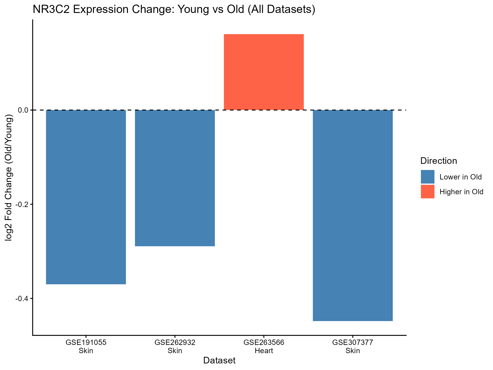
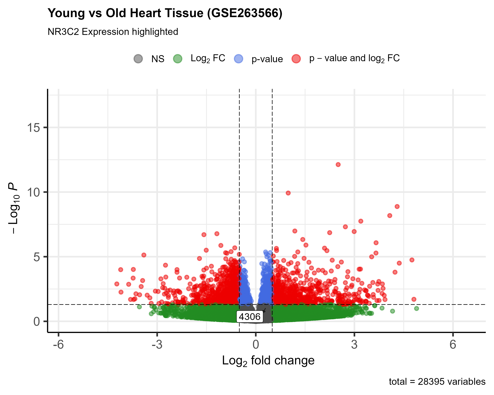
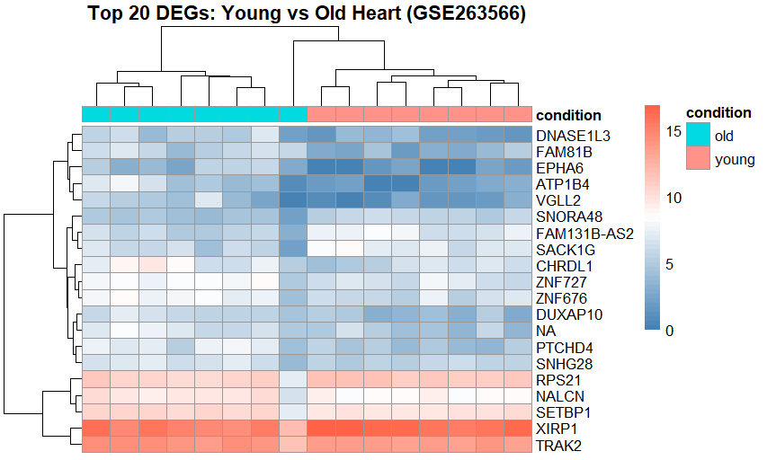
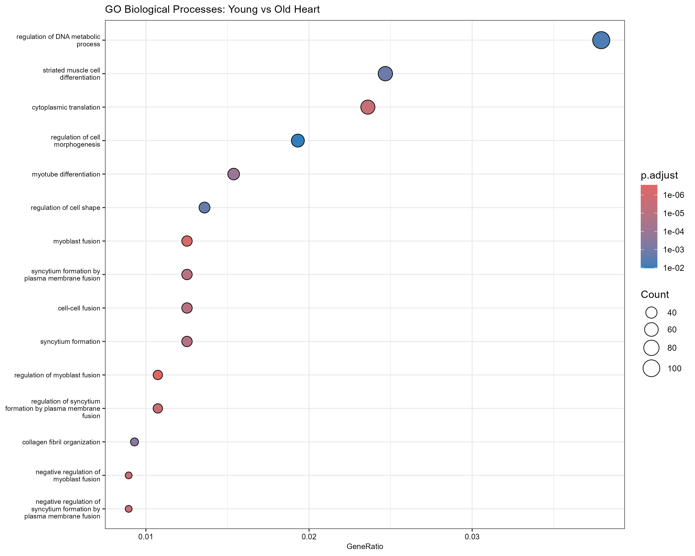

# NR3C2 Aging Expression Analysis
### A Bioinformatics Study of Mineralocorticoid Receptor Expression in Young vs Aged Tissues

---

## Overview
This project investigates the expression of **NR3C2** (Mineralocorticoid Receptor gene) 
in young vs aged samples across multiple public GEO datasets using R.

---

## Datasets
| Dataset | Tissue | Young | Old | Platform |
|---|---|---|---|---|
| GSE307377 | Skin Fibroblast | 4 | 5 | RNA-seq |
| GSE191055 | Skin Fibroblast | 1 | 1 | RNA-seq |
| GSE262932 | Skin Fibroblast | 3 | 3 | RNA-seq |
| GSE263566 | Heart Tissue | 8 | 8 | RNA-seq |

---

## Key Findings
- NR3C2 shows consistent **downregulation** in aged skin fibroblasts across 3 datasets
- NR3C2 shows **upregulation** in aged heart tissue
- DESeq2 analysis revealed **860 differentially expressed genes** in cardiac aging
- GO enrichment identified **muscle differentiation and cell fusion** as top enriched pathways

---

## Methods
- GEO data retrieval using **GEOquery**
- Differential expression analysis using **DESeq2**
- Statistical testing: **t-test, Wilcoxon test, Fisher's method**
- Pathway enrichment: **clusterProfiler, GO analysis**
- Visualization: **ggplot2, EnhancedVolcano, pheatmap**

---

## Results

### NR3C2 Expression Across All Datasets

### Volcano Plot — Heart Tissue (GSE263566)

### Heatmap — Top 20 DEGs in Heart Tissue

### GO Enrichment Analysis

---

## Repository Structure
| File | Description |
|---|---|
| 01_install_packages.R | Package installation |
| 02_NR3C2_analysis.R | NR3C2 specific analysis |
| 03_GSE262932_analysis.R | Skin fibroblast analysis |
| 04_GSE263566_analysis.R | Heart tissue analysis |
| 05_statistical_testing.R | t-test and Wilcoxon test |
| 06_final_report.R | Final report generation |
| 07_meta_analysis.R | Meta-analysis |
| 08_DESeq2_GSE263566.R | Full DESeq2 pipeline |
| 09_GO_enrichment.R | GO enrichment analysis |

---

## Author
**Shahrzad Zamani**
MSc Medical Genetics and Biology Student
Bioinformatics Researcher
📧 shahrzadzamani390@gmail.com
